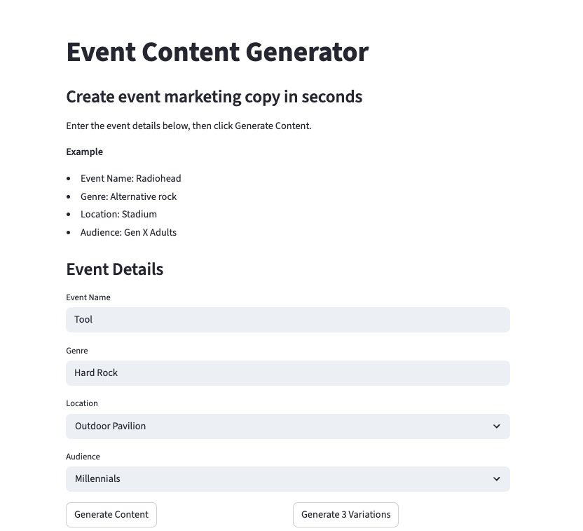
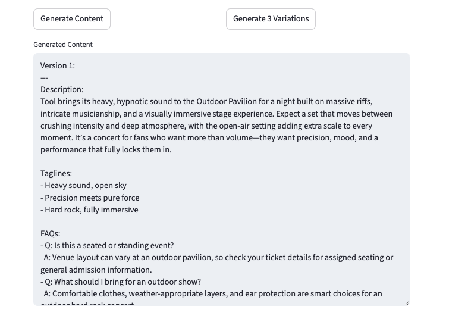

# Event Content Generator

A Streamlit-based generative AI app that creates event descriptions, taglines, and FAQs from structured inputs.

## Features
- Structured inputs (Event Name, Genre, Location, Audience)
- AI-generated marketing content
- Multi-variation generation
- Clean UI with Streamlit

## Tech Stack
- Python
- Streamlit
- OpenAI API

## Live App
https://event-content-generator-rswkclntjhan82r3wscr3b.streamlit.app/

## How to Run Locally
1. Install dependencies:
pip install -r requirements.txt

2. Run:
streamlit run app.py

## Screenshots

### Event Input Form

### Generated Output

